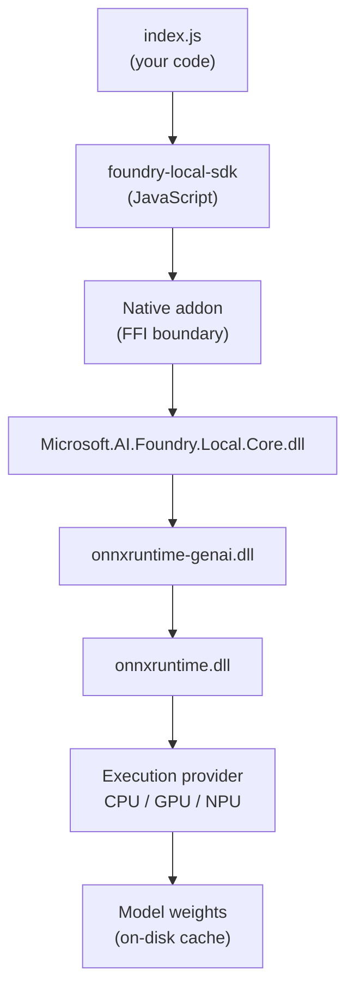

# foundry-first

A minimal command-line chat client that runs a large language model **entirely on your own machine** — no cloud, no API key, no network round-trip at inference time.

It is built on [Microsoft Foundry Local](https://learn.microsoft.com/azure/ai-foundry/foundry-local/), which wraps ONNX Runtime and ONNX Runtime GenAI behind a small JavaScript SDK. The whole application is one file, [`index.js`](index.js), kept deliberately short so the full lifecycle of a local model — resolve, download, load, infer, unload — is readable end to end.

```console
$ node index.js "What is the capital of France?"
Model qwen2.5-0.5b-instruct-generic-cpu:4 already cached, skipping download.
The capital of France is Paris. It's a beautiful city known for its rich history...
```

Tokens stream to stdout as they are generated.

---

## Contents

- [Requirements](#requirements)
- [Quickstart](#quickstart)
- [Design](#design)
  - [Why Foundry Local](#why-foundry-local)
  - [Execution model](#execution-model)
  - [Lifecycle](#lifecycle)
  - [Design decisions](#design-decisions)
- [Developing](#developing)
  - [Project layout](#project-layout)
  - [Making local changes](#making-local-changes)
  - [Where things live on disk](#where-things-live-on-disk)
  - [Debugging](#debugging)
  - [Troubleshooting](#troubleshooting)
- [License](#license)

---

## Requirements

| | |
|---|---|
| **OS** | Windows 10/11 on x64. See [Other platforms](#other-platforms) below. |
| **Node.js** | v18+ for top-level `await` and native ESM. Developed against v24.18.0. |
| **Disk** | ~46 MB of native runtime libraries, plus model weights — ~840 MB for the default model. |
| **Network** | Only for the first run, to download the runtime and model. Inference is fully offline. |

## Quickstart

```bash
git clone https://github.com/appwiz/foundry-first.git
cd foundry-first
npm install
node index.js "Explain the Monty Hall problem in two sentences."
```

The first `npm install` downloads platform-specific native libraries (~47 MB). The first `node index.js` downloads the model weights and prints a progress bar; every run after that starts straight from the local cache.

---

## Design

### Why Foundry Local

Running an LLM locally normally means picking up a stack of concerns — obtaining weights in the right quantization, choosing an execution provider matching the hardware, managing the runtime's memory lifecycle, and exposing an inference API. Foundry Local bundles these behind one SDK:

- **A model catalog** that resolves a friendly alias (`qwen2.5-0.5b`) to the concrete build best suited to the current machine (`qwen2.5-0.5b-instruct-generic-cpu:4`).
- **A managed cache**, so weights are fetched once and reused across processes.
- **An OpenAI-shaped API surface**, so the message and response formats are the same ones used against hosted models — porting code between local and cloud is mostly a matter of swapping the client.

This project is the smallest useful thing built on that foundation: a single-turn chat CLI.

### Execution model

The SDK is not a network client talking to a background server. It loads a **native addon** into the Node process and calls into it over FFI:



The practical consequences are worth internalizing:

- **The model lives in this process.** Its memory is the Node process's memory, and it is released when the process exits or `unload()` is called — whichever comes first.
- **There is no server to start** for chat completions. That is why the code never mentions a port or a base URL.
- **Native libraries must match the platform**, because DLLs are not portable. This is the single most common source of setup failure; see [Troubleshooting](#troubleshooting).

There *is* an optional HTTP path — `manager.startWebService()` exposes an OpenAI-compatible endpoint, and `createResponsesClient(baseUrl)` speaks the Responses API over it. This project does not use it. The in-process FFI path avoids the serialization hop and keeps the program to one moving part.

### Lifecycle

Everything in [`index.js`](index.js) is one linear pass, using top-level `await` (enabled by `"type": "module"` in [`package.json`](package.json)):

| Stage | Call | Notes |
|---|---|---|
| 1. Read input | `process.argv.slice(2).join(' ')` | Exits with a usage message when empty, before any expensive work. |
| 2. Initialize | `FoundryLocalManager.create({ appName })` | Boots the native core. Returns a **singleton** — repeat calls hand back the same instance. |
| 3. Resolve | `manager.catalog.getModel('qwen2.5-0.5b')` | Alias → best variant for this hardware. |
| 4. Download | `model.download(onProgress)` | Skipped when `model.isCached`. Progress callback receives 0–100. |
| 5. Load | `model.load()` | Reads weights into memory / onto the accelerator. The slow step on a warm cache. |
| 6. Infer | `chatClient.completeStreamingChat(messages)` | Returns an `AsyncIterable` of OpenAI-shaped chunks. |
| 7. Release | `model.unload()` | Frees the model. |

### Design decisions

**Validate the prompt first.** Argument checking happens at the top of the file, before the manager is constructed. Initializing the native core and resolving a model take real time; there is no reason to pay that cost only to discover the user passed no prompt.

**Check the cache explicitly.** `download()` is safe to call unconditionally, but branching on `model.isCached` lets the program say *why* it is fast on a warm start rather than appearing to hang or silently no-op. Observable behavior beats a clever one-liner in a program meant to be read.

**Stream rather than block.** `completeChat()` resolves once with the finished response; `completeStreamingChat()` yields chunks as the model produces them. For a CLI where a small model still takes seconds to finish a paragraph, streaming turns dead air into visible progress. The cost is a slightly more involved consumer:

```js
for await (const chunk of chatClient.completeStreamingChat(messages)) {
    const content = chunk.choices?.[0]?.delta?.content;
    if (content) {
        process.stdout.write(content);
    }
}
```

The optional chaining is load-bearing. Chunks carry `delta.content` (an increment) rather than `message.content` (the whole reply), and the field is **absent** on the first and last chunks — those carry role and finish-reason metadata instead. Without the guard, the stream would print `undefined` at both ends.

**Use `create()`, not `createAsync()`.** `create()` blocks the event loop during initialization. In a CLI that has nothing else to do, that is fine and keeps the code linear. A server or GUI should use `createAsync()` instead, so initialization does not stall other work.

**Unload explicitly.** Process exit would release the model anyway. The call is kept because it marks the end of the lifecycle for a reader, and because it is exactly what a longer-lived program *must* do to avoid pinning hundreds of megabytes.

**Default to a very small model.** `qwen2.5-0.5b` has 0.5 billion parameters — small enough to download quickly and run on a plain CPU with no GPU. It is chosen to prove the plumbing works on any machine, not for answer quality. Expect it to be confidently wrong on occasion; the sample output above wanders into questionable claims about Parisian dialects.

---

## Developing

### Project layout

```
foundry-first/
├── index.js            # The entire application
├── package.json        # ESM, one dependency
├── package-lock.json
├── LICENSE             # GPL-3.0
└── .gitignore          # Excludes node_modules/ and machine-local settings
```

`node_modules/` is **not** committed. It holds ~47 MB of platform-specific native binaries that would break a clone on any other OS.

### Making local changes

Edit [`index.js`](index.js) and re-run — there is no build step. The project is plain ESM JavaScript executed directly by Node.

**Change the model.** Swap the alias on the `getModel` line:

```js
const model = await manager.catalog.getModel('phi-3.5-mini');
```

To see what is available, list the catalog:

```js
const models = await manager.catalog.getModels();
console.log(models.map((m) => `${m.alias}  (${m.id})`).join('\n'));
```

Related catalog methods: `getModelVariant(id)` for a specific build, `getCachedModels()` for what is already downloaded, `getLoadedModels()` for what is resident, and `getLatestVersion(model)` to check for a newer build.

**Tune sampling.** The chat client exposes settings that map onto the usual OpenAI parameters. Set them after creating the client, before completing:

```js
const chatClient = model.createChatClient();
chatClient.settings.temperature = 0.2;
chatClient.settings.maxTokens = 512;
chatClient.settings.randomSeed = 42;    // reproducible output
```

Also available: `topP`, `topK`, `frequencyPenalty`, `presencePenalty`, `n`, `responseFormat` (for JSON-mode style constrained output), and `toolChoice`.

**Hold a conversation.** The SDK is stateless between calls — it does not track history for you. Multi-turn means accumulating the array yourself and passing the whole thing each time:

```js
const messages = [{ role: 'system', content: 'You are terse.' }];
messages.push({ role: 'user', content: prompt });
// ...stream the reply, collecting it into `reply`...
messages.push({ role: 'assistant', content: reply });
```

Watch the model's `contextLength` — older turns must be dropped or summarized once the accumulated history approaches it.

**Call tools.** Both completion methods take an optional second argument of tool definitions, in OpenAI's function-calling shape. Check `model.supportsToolCalling` first; not every catalog model does.

**Use other modalities.** The same model object also exposes `createEmbeddingClient()` and `createAudioClient()`. `model.inputModalities` and `model.outputModalities` report what a given model actually supports.

**Force a specific hardware variant.** `getModel()` auto-selects, but you can override:

```js
console.log(model.variants.map((v) => v.id));
model.selectVariant(model.variants.find((v) => v.id.includes('gpu')));
```

Execution providers can be inspected and installed at runtime via `manager.discoverEps()` and `manager.downloadAndRegisterEps()`.

### Where things live on disk

Paths derive from `appName`, which is `'my-app'` in this project — change it in the `create()` call and every path below moves with it.

| What | Default location |
|---|---|
| App data root | `%USERPROFILE%\.my-app` |
| Model cache | `%USERPROFILE%\.my-app\cache\models` |
| Logs | `%USERPROFILE%\.my-app\logs` |
| Native libraries | `node_modules/foundry-local-sdk/foundry-local-core/<platform>-<arch>/` |

All are overridable through the config object: `appDataDir`, `modelCacheDir`, `logsDir`, and `libraryPath`.

To reclaim disk space, call `model.removeFromCache()` or delete the cache directory — the next run re-downloads.

### Debugging

Raise the log level; it defaults to `warn`:

```js
const manager = FoundryLocalManager.create({
    appName: 'my-app',
    logLevel: 'debug',    // trace | debug | info | warn | error | fatal
});
```

Logs are written to the logs directory above.

To inspect the full, non-streamed response envelope — `choices`, `usage`, `finish_reason` — switch temporarily to the blocking call:

```js
const response = await chatClient.completeChat(messages);
console.dir(response, { depth: null });
```

### Troubleshooting

**`FoundryLocalCorePath not specified`**

The native libraries for your platform are missing. The SDK looks for `foundry-local-core/<platform>-<arch>/`, and this error means that directory is absent or empty — most often because `node_modules` was copied from a machine with a different OS or CPU architecture, or because the install script did not complete.

Fix it by reinstalling so the platform detection re-runs:

```bash
rm -rf node_modules package-lock.json
npm install
```

A correct Windows x64 install contains five DLLs:

```
node_modules/foundry-local-sdk/foundry-local-core/win32-x64/
├── Microsoft.AI.Foundry.Local.Core.dll
├── Microsoft.Windows.AI.MachineLearning.dll
├── onnxruntime.dll
├── onnxruntime-genai.dll
└── onnxruntime_providers_shared.dll
```

If they still do not appear, point the SDK at them directly with the `libraryPath` config option.

**The import and the dependency have different names**

[`package.json`](package.json) depends on `foundry-local-sdk-winml`, but [`index.js`](index.js) imports `foundry-local-sdk`. This is intentional, not a mistake. The `-winml` package contains no API of its own — it is an installer wrapper that declares `foundry-local-sdk` as a dependency and runs an install script fetching the **WinML** build of the native runtime (Windows ML 2.1.1, ONNX Runtime 1.26.0, ONNX Runtime GenAI 0.14.1) rather than the standard build. You install the variant; you import the base package.

<a name="other-platforms"></a>
**Other platforms**

Swap the WinML wrapper for the base package, which ships native libraries for non-Windows targets:

```bash
npm uninstall foundry-local-sdk-winml
npm install foundry-local-sdk
```

No change to `index.js` is needed — the import path is already correct.

---

## License

Copyright (C) 2026 Rohan Deshpande

This program is free software: you can redistribute it and/or modify it under the terms of the GNU General Public License as published by the Free Software Foundation, either version 3 of the License, or (at your option) any later version.

This program is distributed in the hope that it will be useful, but WITHOUT ANY WARRANTY; without even the implied warranty of MERCHANTABILITY or FITNESS FOR A PARTICULAR PURPOSE. See the [GNU General Public License](LICENSE) for more details.

The Foundry Local SDK itself is a separate work, distributed by Microsoft under the MIT license.
